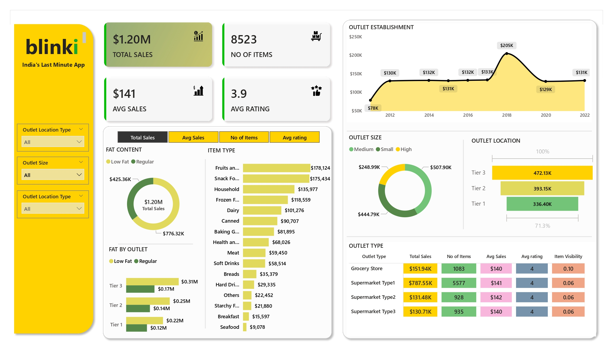

# Blinkit Sales Dashboard

## Project Overview
This dashboard provides a comprehensive analysis of Blinkit's sales performance, examining key metrics across product types, fat content, outlet characteristics, and geographic locations. Insights from the dashboard help guide strategic decisions regarding inventory management, pricing, outlet optimization, and customer engagement.

 

## Tools & Technologies
- **Data Visualization:** Power BI (or specify tool used)  
- **Data Source:** <a href="https://github.com/rif2002/Blinkit-Sales/blob/main/BlinkIT%20Grocery%20Data.xlsx">BlinkIT Grocery Data</a> 

 

## Key Performance Indicators (KPIs)
The dashboard tracks four critical KPIs:

| KPI | Definition | Snapshot Value |
|-----|------------|----------------|
| Total Sales | Total revenue generated from all items sold | $1.20M |
| Average Sales | Average revenue per transaction | $141 |
| Number of Items | Count of distinct items sold | 8523 |
| Average Rating | Average customer rating for sold items | 3.9 |

 

## Business Requirements / Questions
1. How does fat content impact total sales, and how do other KPIs vary with fat content?  
2. Which item types contribute the most to total sales, and how do other KPIs vary across item types?  
3. How do different outlets perform in terms of sales segmented by fat content, and what are the trends in other KPIs?  
4. How does the age or type of outlet establishment influence total sales over time?  
5. How does outlet size correlate with total sales?  
6. What is the geographic distribution of sales across outlet locations?  
7. How do all key metrics vary by outlet type?  

 

## Insights / Analysis

### 1. Total Sales by Fat Content
- **Insight:** Regular fat items generate **$776.32K**, outperforming Low Fat items (**$425.36K**).  
- **Other KPIs:** Average Sales, Number of Items, and Average Rating are slightly higher for Regular fat products.  
- **Implication:** Consumer preference leans toward Regular fat products; prioritizing these can drive higher revenue.

### 2. Total Sales by Item Type
- **Insight:** **Fruits & Vegetables ($178,124)** and **Snack Foods ($175,434)** are top contributors; **Seafood ($9,078)** is lowest.  
- **Other KPIs:** Average Sales and Ratings are consistent across top-selling categories.  
- **Implication:** Focus on core grocery and snack categories while exploring strategies for underperforming items.

### 3. Fat Content by Outlet Tier
- **Insight:** **Tier 3 outlets** have the highest total sales for both Regular ($0.31M) and Low Fat ($0.17M) items.  
- **Other KPIs:** Contribution of Regular fat to total sales dominates across all tiers.  
- **Implication:** Regular fat products consistently drive higher revenue, regardless of outlet tier.

### 4. Total Sales by Outlet Establishment
- **Insight:** Sales increased from **$78K in 2012** to a peak of **$205K in 2018**, then stabilized at **$131K in 2022**.  
- **Implication:** Growth has plateaued; opportunities exist for product diversification or outlet expansion.

### 5. Sales by Outlet Size
- **Insight:** Medium outlets lead in sales (**$507.90K**), followed by Small (**$444.79K**) and High (**$248.99K**).  
- **Implication:** Medium-sized outlets balance traffic and inventory efficiency, making them key revenue drivers.

### 6. Sales by Outlet Location
- **Insight:** Tier 3 locations contribute the most (**$472.13K, 28.7%**), followed by Tier 2 (**$393.15K**) and Tier 1 (**$336.40K**).  
- **Implication:** Geographic prioritization of Tier 3 outlets can maximize revenue. Some sales are unclassified, indicating potential emerging markets.

### 7. All Metrics by Outlet Type
- **Insight:** **Supermarket Type1** has the highest Total Sales (**$787.55K**) and Number of Items sold (5577). Grocery Stores have lower sales.  
- **Other KPIs:** Average Sales ($140–$141) and Ratings (~4) are consistent across all outlet types.  

## Dashboard Preview

## Strategic Recommendations
1. Prioritize Regular fat products and top-selling categories like Fruits, Vegetables, and Snacks.  
2. Focus inventory and marketing efforts on Medium-sized and Tier 3 outlets.  
3. Leverage consistent Average Ratings while addressing underperforming outlets.  
4. Explore growth opportunities through new products, underperforming outlets, and emerging locations.

 

## Conclusion
The Blinkit Sales Dashboard transforms multi-dimensional sales data into actionable insights, enabling data-driven decisions that optimize product offerings, outlet performance, and overall revenue.
